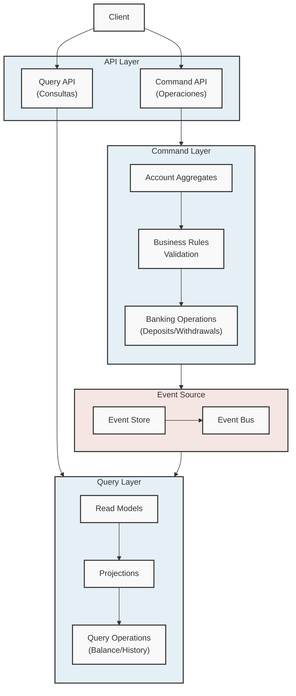
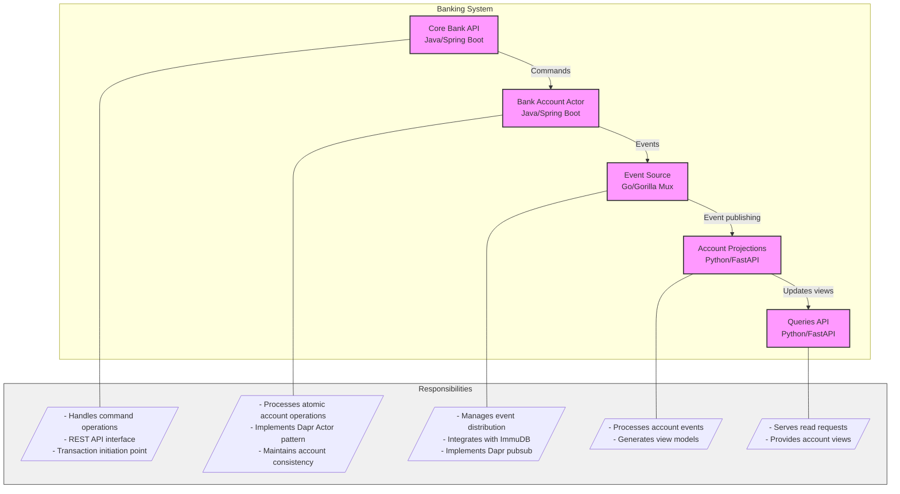
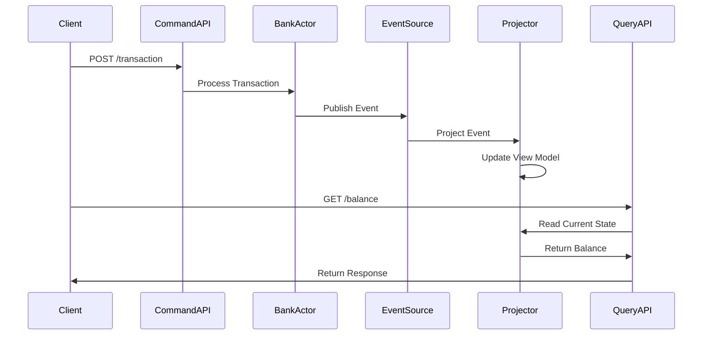

# Core Banking System (ES-CQRS)

[](https://opensource.org/licenses/MIT)
[](https://dapr.io/)

A modern, experimental core banking system implementing Event Sourcing (ES) and Command Query Responsibility Segregation (CQRS) patterns. Built with Dapr, Python, Java, and Go.

This project demonstrates a simplified core banking system that leverages Event Sourcing and CQRS patterns. It handles essential bank account operations such as deposits and withdrawals, while exposing separate REST APIs for commands and queries. The system is built on Dapr (Distributed Application Runtime), showcasing how to use its components to build robust, scalable microservices.

> **_NOTE:_** For Dapr's official documentation
 [read here](https://docs.dapr.io/concepts/overview/) to understand how this project leverages Dapr's building blocks.

 > **_NOTE:_** This project is based on the blog post [A Core banking System Architecture](https://sites.google.com/view/rodrigozamora/blog/arquitectura-para-un-core-banking-system?authuser=0) (in Spanish).

## 🌟 Features

- Event Sourcing architecture for reliable transaction history
- CQRS pattern implementation for optimized read/write operations
- Microservices-based architecture using Dapr building blocks
- Real-time transaction processing
- Separate command and query APIs
- Immutable event log storage
- Scalable projection system for account views

## 🏗️ Architecture

### Logical Architecture

The system is built around these core components:

- **Command Layer**: Implements the Aggregate pattern for atomic banking operations
  - Handles deposits and withdrawals
  - Ensures write consistency through individual account aggregates
  - Validates business rules

- **Query Layer**: Uses the Projection pattern for efficient reads
  - Maintains separate read models
  - Provides optimized views of account data
  - Supports balance and transaction history queries

- **Event Source**: Serves as the system's backbone
  - Ensures event persistence and distribution
  - Maintains the source of truth for all transactions

- **API Layer**: Provides distinct endpoints for operations
  - Command API for account operations
  - Query API for reading account state
  - RESTful interface for client interactions



### Physical Architecture

The system consists of five main components:

1. **Core Bank API** (Java/Spring Boot)
   - Handles command operations
   - REST API interface
   - Transaction initiation point

2. **Bank Account Actor** (Java/Spring Boot)
   - Processes atomic account operations
   - Implements Dapr Actor pattern
   - Maintains account consistency

3. **Event Source** (Go/Gorilla Mux)
   - Manages event distribution
   - Integrates with ImmuDB for event storage
   - Implements Dapr pubsub

4. **Account Projections** (Python/FastAPI)
   - Processes account events
   - Generates view models

5. **Queries API** (Python/FastAPI)
   - Serves read requests
   - Provides account views



### Data Flow Architecture

The system processes transactions through the following flow:

1. **Command Flow**:
   - Client sends transaction request to Command API
   - Command API validates basic request structure
   - Bank Account Actor processes transaction
   - Actor generates and publishes domain events
   - Event Source stores events in ImmuDB
   - Events are published to projection services

2. **Query Flow**:
   - Client requests account information from Query API
   - Query API retrieves projected state from MongoDB
   - Projected state reflects all processed events up to that point



## ⚖️ Architecture Trade-offs

### Advantages

1. **Event Sourcing**:
   - Complete audit trail
   - Temporal query capability
   - State reconstruction
   - Debug capability

2. **CQRS**:
   - Optimized read/write operations
   - Independent scaling
   - Query flexibility

### Limitations

1. **Complexity**:
   - More complex than CRUD
   - Learning curve for developers
   - Additional infrastructure needed

2. **Eventual Consistency**:
   - Read queries may be stale
   - Complex compensation logic
   - Harder to reason about system state

### Ideal Use Cases

- High audit requirements
- Complex business rules
- High read/write ratio difference
- Regulatory compliance needs

## 📁 Project Structure

```
core_banking_system_es_cqrs/
├── aggregates/           # Bank account actor implementation (Java)
├── core_bank_api/       # Command API service (Java)
├── es/                  # Event Source service (Go)
├── libraries/           # Shared utilities and common code
│   ├── java/           # Java shared libraries
│   └── python/         # Python shared libraries
├── projections/
│   └── account/        # Account projections service (Python)
└── queries_bank_api/   # Query API service (Python)
```

## 🚀 Getting Started

### Prerequisites

- Docker Desktop 27.2.0+
- Dapr CLI 1.14.4+ Follow the instructions in the official documentation [here](https://docs.dapr.io/getting-started/install-dapr-cli/)
- Java Development Kit (JDK) 21
- Python 3.12+
- Go 1.23+
- Poetry 1.7.1+
- IDE with Maven support (recommended: IntelliJ IDEA)
- ImmuDB tools v1.9.5 (immudbclient & immudbadmin) from [here](https://github.com/codenotary/immudb/releases)

### Installation

1. **Clone the Repository**
   ```bash
   git clone https://github.com/rzamoramx/core_banking_system_es_cqrs.git
   cd core_banking_system_es_cqrs
   ```

2. **Setup docker containers**
   ```bash
   # Start MongoDB server
   docker run -d --name mongodb-container -p 27017:27017 mongo:7.0

   # Start ImmuDB server
   docker run -d -it --name immudb -p 3322:3322 -p 9497:9497 codenotary/immudb:1.9.5
   ```

3. **Configure Dapr Components**
   Disable all other components in the Dapr runtime, you can do it by changing its file names in the "components" folder (normally it is under .dapr directory in the user home path), for example, change pubsub.yaml to pubsub.yaml.disabled.

   Create the following component configurations in your Dapr components directory:

   `eventsource.yaml`:
   ```yaml
   apiVersion: dapr.io/v1alpha1
   kind: Component
   metadata:
     name: eventsource
   spec:
     type: pubsub.redis
     version: v1
     metadata:
     - name: redisHost
       value: localhost:6379
     - name: redisPassword
       value: ""
   ```

   `statestore.yaml`:
   ```yaml
   apiVersion: dapr.io/v1alpha1
   kind: Component
   metadata:
     name: statestore
   spec:
     type: state.redis
     version: v1
     metadata:
     - name: redisHost
       value: localhost:6379
     - name: redisPassword
       value: ""
     - name: actorStateStore
       value: "true"
   ```

4. **Setup ImmuDB**

    For first time, Immudb prompts you to change the default password. Follow the instructions to set "immudb1" as the new password or whatever you prefer.
   ```bash
   ./immuadmin login immudb
   ./immuadmin database create eventsourcedb
   ./immuclient use eventstoredb
   ```

5. **Initialize MongoDB**
    You can use a GUI like MongoDB Compass or a command line to create the required collections. Create a database named `mydb` and two collections named `balance` and `transactions`.

6. **Build Shared Libraries**
   ```bash
   # Java libraries
   cd libraries/java
   mvn clean install

   # Python libraries
   cd ../python
   poetry install
   ```

7. **Start Services**
   Follow the individual README files in each service directory for specific startup instructions.
    - Core Bank API [here](core_bank_api/README.md).

    - Bank Account Actor [here](aggregates/README.md).

    - Event Source [here](es/README.md).

    - Account Projections [here](projections/account/README.md).

    - Queries API [here](queries_bank_api/README.md).

## 🔍 Usage

### Create a Transaction

You will see all components interacting with each other to process the transaction seeing the logs in each console.

```bash
curl -X POST http://localhost:8081/mybank/api/v1/account/transaction \
  -H "Content-Type: application/json" \
  -d '{
    "account_id": "1234",
    "amount": 100.00,
    "transaction_type": "DEPOSIT"
  }'
```

### Check Account Balance

Where 1234 is the account id you used in the previous request.
```bash
curl -X GET http://localhost:8003/mybank/api/v1/account/1234/balance
```

### View Transaction History

Where 1234 is the account id you used in the previous request.
```bash
curl -X GET http://localhost:8003/mybank/api/v1/account/1234/history
```

## 🛠️ Technology Stack

- **Runtime**: 
  - [Dapr](https://dapr.io/)
- **Services**:
  - Java/Spring Boot
  - Python/FastAPI
  - Go/Gorilla Mux
- **Storage**:
  - MongoDB (Projections)
  - ImmuDB (Event Store)
  - Redis (Dapr state store)

## 🤝 Contributing

Contributions are welcome! Please feel free to submit a Pull Request.

1. Create your feature branch (`git checkout -b feature/AmazingFeature`)
2. Commit your changes (`git commit -m 'Add some AmazingFeature'`)
3. Push to the branch (`git push origin feature/AmazingFeature`)
4. Open a Pull Request


## 🎯 Roadmap

- [ ] **Compensation commands**: Implement compensating transactions for failed operations (sagas)
- [ ] **Security**: Add authentication and authorization to APIs

### Event Source

- [ ] **Retrieval**: Provides API for historical event access
- [ ] **Auditing**: Implements event verification and auditing

### Aggregates

- [ ] **Rewind capability**: Supports event replay for state reconstruction

### Querying API

- [ ] **Pagination**: Adds pagination support for large result sets
- [ ] **Chaching**: Implements caching for improved performance

## 📝 License

This project is licensed under the MIT License - see the [LICENSE](LICENSE) file for details.

## 🙏 Acknowledgments

- The Dapr community for their amazing work on building a powerful runtime for microservices.

## 📚 Additional Resources

- [Based on this blog post "A Core banking System Architecture"](https://sites.google.com/view/rodrigozamora/blog/arquitectura-para-un-core-banking-system?authuser=0) (in Spanish).
- [Dapr Documentation](https://docs.dapr.io/)
- [Event Sourcing Pattern](https://microservices.io/patterns/data/event-sourcing.html)
- [CQRS Pattern](https://microservices.io/patterns/data/cqrs.html)
