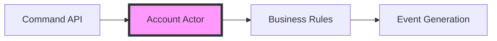

# Bank Account Aggregate Service

[](https://www.oracle.com/java/)
[](https://spring.io/projects/spring-boot)
[](https://dapr.io/)

This directory contains the Bank Account Actor implementation using Java and Spring Boot. It is a critical part of the system's write model, ensuring that bank account transactions are processed atomically through the Dapr Actor building block.

- Implements the Aggregate pattern for bank accounts
- Uses Dapr Actors and Dapr State Store for distributed state management
- Ensures atomic operations for deposits and withdrawals
- Generates and publishes events to Event Source
- Enforces business rules for banking operations

## 🏗️ Architecture

### Actor Model Implementation

Each bank account is modeled as a Dapr Actor, providing:

- **State Isolation**: Each account's state is managed independently
- **Concurrency Control**: Dapr actor model handles concurrent requests
- **Persistence**: Reliable state storage with Dapr's state management

### Event Flow



## 🚀 Setup

### Prerequisites

1. **Verify Java Installation**
   ```bash
   java -version
   mvn -version
   ```

2. **Shared code installation**
   ```bash
   cd core_banking_system_es_cqrs/libraries/java/common_lib
   mvn clean install
   ```

### Build

1. **Navigate to Project Directory**
   ```bash
   cd core_banking_system_es_cqrs/aggregates
   ```

2. **Build with Maven**
   ```bash
   mvn clean package
   ```

3. **Verify Build**
   ```bash
   ls target/bank_account_aggregate-0.0.1-SNAPSHOT.jar
   ```

## 🏃‍♂️ Running the Service

### Development Mode

```bash
dapr run \
    --app-id bankaccountactorservice \
    --app-port 3000 \
    -- java -jar target/bank_account_aggregate-0.0.1-SNAPSHOT.jar \
    com.ivansoft.java.core.bank.aggregates.BankAccountActorService -p 3000
```

### Configuration Options

| Parameter | Description | Default |
|-----------|-------------|---------|
| `--app-id` | Unique identifier for the service | `bankaccountactorservice` |
| `--app-port` | Port for the service to listen on | `3000` |
| `-p` | Application port (must match app-port) | `3000` |

## 💡 Implementation Details

### Actor Implementation

With Dapr's SDK, register actor in Dapr runtime and starts the servcie with spring boot
    
```java
public class BankAccountActorService {
    public static void main(String[] args) throws Exception {
        ...

        // Register the Actor class in Dapr runtime
        ActorRuntime.getInstance().registerActor(BankAccountActorImpl.class);

        AggregatesApplication.start(port);
    }
}
```

### Business Rules

The aggregate enforces several business rules:
- Minimum balance requirements
- [TODO] Transaction limits
- [TODO] Account status validation
- [TODO] Overdraft protection

### Event Generation

For each operation, the actor generates events:
- `transaction.v1` [TODO] change name to represent a verb in past tense

## 🐛 Troubleshooting

Common issues and solutions:

1. **Actor Not Responding**
   ```bash
   dapr logs --app-id bankaccountactorservice
   ```

2. **State Store Connection Issues**
   - Verify Redis is running
   - Check Dapr component configuration
   - Validate network connectivity

## 📚 API Reference

### Actor Interface

```java
@ActorType(name = "bankaccount")
public interface BankAccountActor {
    @ActorMethod(name = "transaction", returns = String.class)
    Mono<String> transaction(TransactionDetails transactionDetails);
}
```

### Transaction model

```java
public class TransactionDetails {
    private TransactionType type;
    private Double amount;
}
```

## 🔗 Related Components

- [Core Bank API](../core_bank_api/README.md)
- [Event Source](../es/README.md)
- [Account Projections](../projections/account/README.md)
- [Queries Bank API](../queries_bank_api/README.md)

## 🛠️ Development

### Project Structure

```
aggregates/
├── src/main/java/com/ivansoft/java/core/bank/aggregates/
│   ├── actors/                       # Dapr Actor implementations
│   │   ├── BankAccountActorService   # Actor service entry point
│   │   ├── BankAccountActorImpl      # Actor implementation
│   │   ├── TransactionDetails        # Transaction model
│   ├── services/                     # Business logic services
│   │   ├──EventSourceService         # Event generation
│   ├── BankAccountActorService       # Main application entry point
│   ├── AggregatesApplication         # Spring Boot application
│   └── resources
│       └── application.properties    # Configuration settings
└── pom.xml                           # Maven project configuration
```

### Shared code

The models classes are in core_banking_system_es_cqrs/libraries/java/common_lib

### Running Tests

[TODO] Add tests for actors and services
