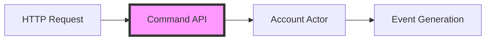

# Core Bank API Service

[](https://www.oracle.com/java/)
[](https://spring.io/projects/spring-boot)
[](https://dapr.io/)

This service implements the command side of the CQRS pattern for core banking operations. It serves as the primary entry point for all write operations (deposits and withdrawals) in the system, implementing a RESTful API that processes commands and forwards them to the appropriate account aggregate.

Key features:
- RESTful API for banking operations
- Command handling for deposits and withdrawals
- Integration with Dapr Actors for account operations

## 🏗️ Architecture

### Command Flow



### API Design

The service follows REST best practices:
- Resource-based URLs
- Proper HTTP method usage
- Consistent error responses
- Versioned API endpoints

## 🚀 Setup

### Prerequisites

1. **Verify Java Installation**
   ```bash
   java -version
   mvn -version
   ```

2. **Shared code installation**
   ```bash
   cd core_banking_system_es_cqrs/libraries/java/common_lib
   mvn clean install
   ```

### Build

1. **Navigate to Project Directory**
   ```bash
   cd core_banking_system_es_cqrs/core_bank_api
   ```

2. **Build with Maven**
   ```bash
   mvn clean package
   ```

3. **Verify Build**
   ```bash
   ls target/api-0.0.1-SNAPSHOT.jar
   ```

## 🏃‍♂️ Running the Service

### Development Mode

```bash
dapr run \
    --app-id corebankapi \
    --app-protocol http \
    --app-port 8081 \
    -- java -jar target/api-0.0.1-SNAPSHOT.jar
```

### Configuration Options

| Parameter | Description | Default |
|-----------|-------------|---------|
| `--app-id` | Unique identifier for the service | `corebankapi` |
| `--app-protocol` | Communication protocol | `http` |
| `--app-port` | Port for the service to listen on | `8081` |

## 💡 API Reference

### Endpoints

#### Create Transaction

```http
POST /mybank/api/v1/account/transaction
```

**Request Body**
```json
{
    "account_id": "string",
    "amount": "number",
    "transaction_type": "DEPOSIT|WITHDRAWAL"
}
```

### Error Responses

The API uses standard HTTP status codes and provides detailed error messages:

| Status Code | Description |
|-------------|-------------|
| 400 | Bad Request - Invalid input parameters |
| 404 | Not Found - Account not found |
| 409 | Conflict - Transaction could not be processed |
| 500 | Internal Server Error |

## 🔒 Security

- Input validation on all endpoints
- [TODO] JWT authentication
- [TODO] Rate limiting
- [TODO] API key management

## 🐛 Troubleshooting

Issues and solutions:

1. **Service Not Starting**
   ```bash
   dapr logs --app-id corebankapi
   ```

2. **Actor Communication Issues**
   - Verify Bank Account Actor service is running
   - Check Dapr configuration
   - Validate network connectivity

3. **In terminal cannot run bacause common lib cannot locate**
   - Ensure common library is installed and available in the classpath
      You can run clean and install of common library and clean package of this service from Intellij mvn panel

## 🔍 Monitoring

The service exposes the following metrics:
- [TODO] Transaction throughput
- [TODO] Response times
- [TODO] Error rates
- [TODO] Actor communication latency

## 🔗 Related Components

- [Bank Account Actor](../aggregates/README.md)
- [Event Source](../es/README.md)
- [Account Projections](../projections/account/README.md)
- [Queries Bank API](../queries_bank_api/README.md)

## 🛠️ Development

### Project Structure

```
core_bank_api/
├── src
│   ├── main
│   │   ├── java/com/ivansoft/java/core/bank/api/
│   │   │   ├── controllers/      # REST controllers
│   │   │   │   ├── BankAccountController.java # Account operations
│   │   │   ├── models/           # Data models
│   │   │   │   ├── RequestAccountTransaction.java # Transaction request
│   │   │   │   ├── Response.java # Generic response
│   │   │   ├── actors/           # Dapr Actor interfaces
│   │   │   │   ├── BankAccountActor.java # Account operations
│   │   │   │   ├── BankAccountActorClient.java # Actor client
│   │   │   │   ├── TransactionDetails.java # Transaction model
│   │   │   └── ApiApplication.java  # Spring Boot application entry point
│   └── resources
│       └── application.properties  # Configuration settings
└── pom.xml                        # Maven project configuration
```

### Shared code

The models classes are in core_banking_system_es_cqrs/libraries/java/common_lib

### Running Tests

[TODO] Add tests for controllers and actors
