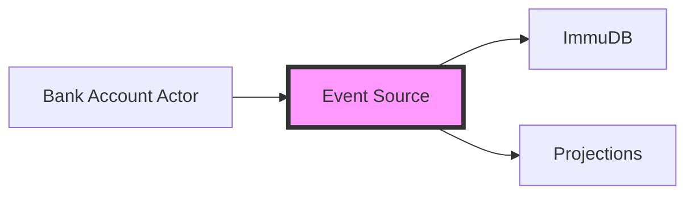

# Event Source Service

[](https://golang.org/)
[](https://github.com/gorilla/mux)
[](https://dapr.io/)
[](https://immudb.io/)

This directory contains the Event Source implementation using Go and Gorilla Mux. It serves as the system's event backbone, managing the flow and persistence of all banking events through Dapr's pub/sub building block and ImmuDB's immutable ledger.

- Implements the Event Sourcing pattern for banking transactions
- Uses Dapr pub/sub for reliable event distribution
- Leverages ImmuDB for tamper-proof event storage
- Provides event retrieval capabilities

## 🏗️ Architecture

### Event Flow Implementation

The Event Source service manages the event lifecycle:

- **Event Reception**: Receives events through Dapr pub/sub
- **Persistence**: Stores events in ImmuDB's immutable ledger
- **Distribution**: Forwards events to interested subscribers

### System Integration Flow



## 🚀 Setup

### Prerequisites

1. You can add parameters for connecting to Immudb in the config-dev.json file if you've changed the username, password, or database; otherwise, you don't need to change anything.

You can use the Immudb client to see how banking transactions persist; point 4 of the installation section [README.md](../README.md#installation) file. See the official documentation for other usage of Immudb such auditing, querying, etc. <a href="https://docs.immudb.io/master/connecting/clitools.html#immuclient" target="_blank" rel="noopener noreferrer">here</a>

### Install dependencies

1. **Navigate to Project Directory**
   ```bash
   cd core_banking_system_es_cqrs/es
   ```

2. **Install Dependencies**
   ```bash
   go mod tidy
   ```

## 🏃‍♂️ Running the Service

### Development Mode

```bash
dapr run \
    --app-id eventsourcestore \
    --app-port 8002 \
    -- go run main.go -port 8002
```

### Configuration Options

| Parameter | Description | Default |
|-----------|-------------|---------|
| `--app-id` | Unique identifier for the service | `eventsourcestore` |
| `--app-port` | Port for the service to listen on | `8002` |
| `-port` | Application port (must match app-port) | `8002` |

## 💡 Implementation Details

### Event Handler Implementation

First Dapr lookup for subscription endpoint, so the service provides a subscription configuration and endpoint to handle incoming events

```go
    // Programmatic subscription, instead declarative way (pubsub component yaml file
	// in Dapr directory). Handle the /dapr/subscribe route which Dapr invokes to get
	// the list of subscribed endpoints
	r.HandleFunc("/dapr/subscribe",
		handlers.ToSubscribe).Methods("GET")

	// Dapr subscription routes transactions topic to this route
	r.HandleFunc("/transactions/subscriber/v1/handler",
		handlers.SaveEvent(immudbClient)).Methods("POST")
```

### Event Storage

The service uses ImmuDB to provide:
- Immutable event log
- Cryptographic verification
- Temporal queries

### Event Distribution

Leverages Dapr pub/sub to:
- Ensure reliable delivery
- Handle back-pressure
- Manage subscriber registration
- Provide at-least-once delivery semantics

## 🐛 Troubleshooting

Common issues and solutions:

1. **Event Publishing Issues**
   ```bash
   dapr logs --app-id eventsourcestore
   ```

2. **ImmuDB Connection Problems**
   - Verify ImmuDB is running
   ```bash
   docker ps | grep immudb
   ```

3. **Pub/Sub Component Issues**
   - Verify Redis is running
   - Check Dapr component configuration
   - Validate network connectivity

## 📚 API Reference

### REST Endpoints

| Endpoint | Method | Description |
|----------|--------|-------------|
| `/events/{accountId}` | GET | Retrieve events for an account |
| `/events` | POST | Manual event injection (development only) |

## 🔗 Related Components

- [Core Bank API](../core_bank_api/README.md)
- [Bank Account Actor](../aggregates/README.md)
- [Account Projections](../projections/account/README.md)
- [Queries Bank API](../queries_bank_api/README.md)

## 📚 Additional Resources

- [Event Sourcing Pattern](https://martinfowler.com/eaaDev/EventSourcing.html)

## 🛠️ Development

### Project Structure

```
es/
├── db/
│   ├── immudb.go        # ImmuDB client
├── handlers/
│   ├── event.go         # Event handling logic
│   ├── subscriber.go    # Subscription handler
├── models/
│   ├── immudb.go        # ImmuDB models
│   ├── subscription.go  # Dapr event model
├── main.go              # Main entry point
```

### Running Tests

[TODO] Add tests for handlers
