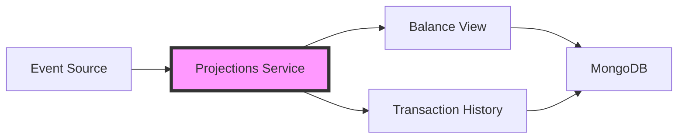

# Account Projections

[](https://www.python.org/)
[](https://fastapi.tiangolo.com/)
[](https://dapr.io/)
[](https://www.mongodb.com/)

This service implements the Projection pattern for the Core Banking System, creating optimized read models from bank account events. It processes events broadcasted by the Event Source to maintain up-to-date views of account balances and transaction histories in MongoDB.

## 🏗️ Architecture

### Projection Implementation

The service maintains two primary projections:

- **Balance Projection**: Real-time account balance calculations
- **Transaction History**: Chronological record of all account operations

### Event Flow



## 🚀 Setup

### Prerequisites

1. **Verify Python Installation**
   ```bash
   python --version  # Should be 3.12
   poetry --version # Should be 1.7.1
   ```

2. **Verify MongoDB**
   ```bash
   mongosh --version
   ```

### Installation

1. **Navigate to Project Directory**
   ```bash
   cd core_banking_system_es_cqrs/projections/account
   ```

2. **Install Dependencies**
   ```bash
   poetry install
   ```

3. **Verify MongoDB Collections**
   
   Ensure the following collections exist in the `mydb` database:
   - `balance`
   - `transactions`

## 🏃‍♂️ Running the Service

### Development Mode

```bash
dapr run \
    --app-id accountprojections \
    --app-port 8000 \
    -- poetry run uvicorn app.main:app --port 8000
```

### Configuration Options

| Parameter | Description | Default |
|-----------|-------------|---------|
| `--app-id` | Unique identifier for the service | `accountprojections` |
| `--app-port` | Port for the service to listen on | `8000` |
| `--port` | Application port (must match app-port) | `8000` |

## 💡 Implementation Details

### Event Handlers

The service subscribes to and processes the following events:
- `Deposit`: Updates balance and records transaction
- `Withdrawal`: Updates balance and records transaction

### MongoDB Schema

#### Balance Collection
```json
{
  "_id": ObjectId,
  "balance": String,
  "currency": String,
  "user_id": Integer,
  "username": String,
  "account_id": String,
  "created_at": DateTime,
  "updated_at": DateTime
}
```

#### Transactions Collection
```json
{
  "_id": ObjectId,
  "id": String,
  "account_id": String,
  "amount": Decimal,
  "type": String,
  "status": String,
  "description": String,
  "timestamp": DateTime,
  "version": Integer
}
```

## 🐛 Troubleshooting

Common issues and solutions:

1. **Event Processing Issues**
   ```bash
   dapr logs --app-id accountprojections
   ```

2. **MongoDB Connection Problems**
   - Verify MongoDB is running:
     ```bash
     docker ps | grep mongodb
     ```
   - Check MongoDB logs:
     ```bash
     docker logs mongodb-container
     ```

3. **Common Error Messages**

   | Error | Solution |
   |-------|----------|
   | `MongoDB connection failed` | Check MongoDB container status and credentials |
   | `Event subscription failed` | Verify Dapr pubsub component configuration |
   | `Projection update failed` | Check MongoDB write permissions |

## 📊 Monitoring

The service exposes the following metrics endpoints:

- [TODO]`/metrics`: Some metrics about the service
- [TODO]`/health`: Service health check

## 🔗 Related Components

- [Core Bank API](../../core_bank_api/README.md)
- [Bank Account Actor](../../aggregates/README.md)
- [Event Source](../../es/README.md)
- [Queries Bank API](../../queries_bank_api/README.md)

## 🛠️ Development

### Project Structure

```
account/
├── app/
│   ├── main.py           # FastAPI application entry point
│   ├── projections/      # Projection implementations
│   │   ├── balance.py    # Balance projection
│   │   └── history.py    # Transaction history projection
│   └── config.py         # Configuration management
├── tests/                # Unit and integration tests
├── poetry.lock          # Dependency lock file
└── pyproject.toml       # Project configuration
```

### Running Tests

[TODO] Add tests for projections

```bash
poetry run pytest
```