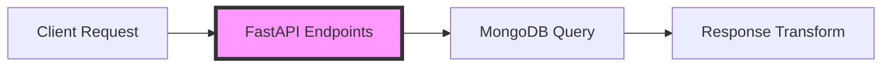

# Queries Bank API

[](https://www.python.org/)
[](https://fastapi.tiangolo.com)
[](https://dapr.io/)
[](https://www.mongodb.com/)

The queries_bank_api service provides a RESTful API for querying account balances and transaction history. It reads from the MongoDB projections created by the account_projections service, enabling efficient reads in a CQRS-based architecture.
Any clients can use this service to retrieve account information without needing to interact with the command side of the system.

- Implements read queries for account balances and transaction history.
- FastAPI framework for fast, asynchronous API handling.

## 🏗️ Architecture

### Query Model Implementation

The service provides two main query endpoints:
- **Balance Query**: Retrieves current account balance
- **Transaction History**: Provides transaction history [TODO] pagination

### Data Flow



## 🚀 Setup

### Prerequisites

1. **Verify Python Installation**
   ```bash
   python --version  # Should be 3.12
   poetry --version # Should be 1.7.1
   ```

2. **Verify MongoDB**
   ```bash
   mongosh --version
   ```

### Installation

1. **Navigate to Project Directory**
   ```bash
   cd core_banking_system_es_cqrs/queries_bank_api
   ```

2. **Install Dependencies**
   ```bash
   poetry install
   ```

## 🏃‍♂️ Running the Service

### Development Mode

```bash
dapr run \
    --app-id queriesbankapi \
    --app-port 8003 \
    -- poetry run uvicorn app.main:app --port 8003
```

### Configuration Options

| Parameter | Description | Default |
|-----------|-------------|---------|
| `--app-id` | Unique identifier for the service | `queriesbankapi` |
| `--app-port` | Port for the service to listen on | `8003` |
| `--host` | Host to bind the service to | `127.0.0.1` |
| `--reload` | Enable auto-reload for development | `false` |

## 💡 Implementation Details

### API Endpoints

```python
@router.get("/mybank/api/v1/account/{account_id}/balance")
async def get_balance(account_id: str):
    """
    Retrieves the current balance for a specific account
    """
    ...

@router.get("/mybank/api/v1/account/{account_id}/history")
async def get_transaction_history(account_id: str):
    """
    Retrieves transaction history for a specific account
    """
    ...
```

### Response Models

This return models as MongoDB stored:

#### Balance
```json
{
  "balance": String,
  "currency": String,
  "user_id": Integer,
  "username": String,
  "account_id": String,
  "created_at": DateTime,
  "updated_at": DateTime
}
```

#### Transactions
```json
{
  "id": String,
  "account_id": String,
  "amount": Decimal,
  "type": String,
  "status": String,
  "description": String,
  "timestamp": DateTime,
  "version": Integer
}
```

## 🐛 Troubleshooting

Common issues and solutions:

1. **MongoDB Connection Issues**
   ```bash
   # Check MongoDB status
   docker ps | grep mongodb
   
   # Check MongoDB logs
   docker logs mongodb-container
   ```

2. **Service Not Responding**
   ```bash
   # Check Dapr logs
   dapr logs --app-id queriesbankapi
   
   # Check FastAPI logs
   poetry run uvicorn app.main:app --log-level debug
   ```

## 📚 API Documentation

Once the service is running, you can access the interactive API documentation at:

[TODO] Refine API documentation

- Swagger UI: `http://localhost:8003/docs`
- ReDoc: `http://localhost:8003/redoc`

### Available Endpoints

#### Get Account Balance
```http
GET /mybank/api/v1/account/{account_id}/balance
```

#### Get Transaction History
```http
GET /mybank/api/v1/account/{account_id}/history
```

## 🔗 Related Components

- [Core Bank API](../core_bank_api/README.md)
- [Bank Account Actor](../aggregates/README.md)
- [Event Source](../es/README.md)
- [Account Projections](../projections/account/README.md)

## 🛠️ Development

### Project Structure

```
queries_bank_api/
├── app/
│   ├── api/
│   │   ├── routes/         # API route definitions
│   │   ├── schemas/        # Request/response schemas
│   ├── config/             # Configuration settings
│   ├── db/                
│   │   ├── balance/        # Repository for account balances
│   │   ├── transaction/    # Repository for transaction history
│   │   ├── user/           # Repository for user information
│   ├── services/           # Business logic
│   │   ├── AccountService.py # Account-related operations
├── main.py                 # FastAPI application
├── tests/                  # Unit tests
```

### Adding New Endpoints

1. Create new route in `app/api/routes/`
2. Define response model in `app/api/schemas/models/`
3. Implement business logic in `app/services/`
4. Add tests in `tests/`

### Running Tests

[TODO] Add tests for balance and transaction repositories and account service

```bash
poetry run pytest
```
